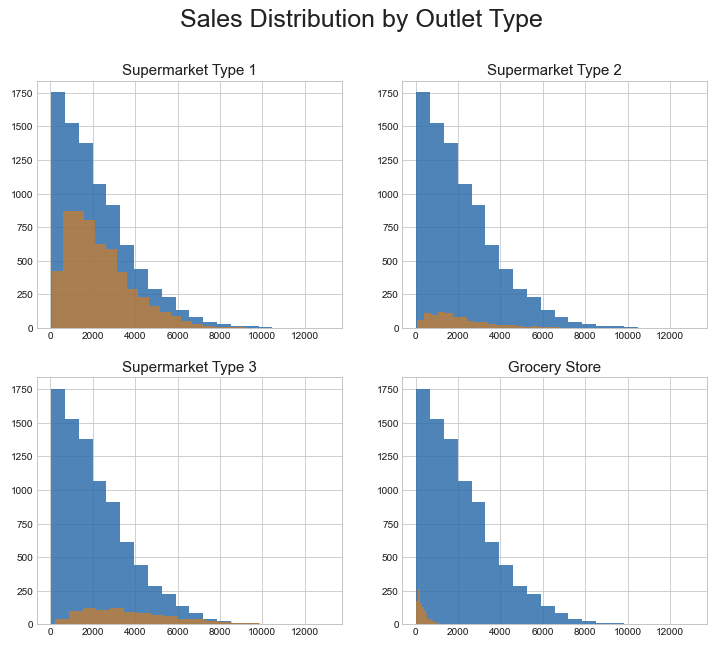
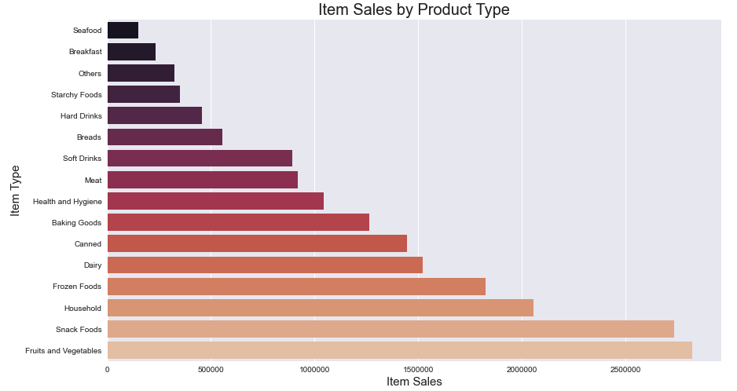

# Grocery Store Sales Precictions

# Objective
## Build and find the best Machine Learning model to predict future sales.

**Author**: 
Darlene Phan

### Business problem:

A small grocery store chain operating locations between 1985 - 2009 are seeking future sales predictions.

### Data
#### Data Dictionary:
| Variable Name      | Description                                                                                       |
| ------------------ | ------------------------------------------------------------------------------------------------- |
| item_id            | Unique prodcut ID                                                                                 |
| item_weight        | Weight of product                                                                                 |
| item_fat_content   | Whether the product is low fat or regular                                                         |
| item_visibility    | The percentage of total display area of all products in a store allocated to a particular product |
| item_type          | The category to which the product belongs                                                         |
| mrp                | Maximum Retail Price (list price) of the product                                                  |
| outlet_id          | Unique store ID                                                                                   |
| est_year           | The year in which store was established                                                           |
| outlet_size        | The size of the store in terms of ground area covered                                             |
| loc_type           | The type of area in which the store is located                                                    |
| outlet_type        | Whether the outlet is a grocery store or some sort of supermarket                                 |
| item_sales         | Sales of the product in the particular store. This is the target variable to be predicted.        |

#### **Target:**
- Item Sales    
#### **Features:**
<!--     - Item Fat Content
    - Item Visibility
    - Item Type
    - MRP
    - Location Type
    - Outlet Type
 -->

   - Item Fat Content
   - Item Visibility
   - Item Type
   - MRP
   - Location Type
   - Outlet Type

## Methods
- Data preparation steps with explanation and justification for choices
- 

## Results

### Here are examples of how to embed images from your sub-folder

#### Visual 1 Title

> Sentence about visualization.

#### Visual 2 Title

## Model

Describe your final model

Report the most important metrics

Refer to the metrics to describe how well the model would solve the business problem

## Recommendations:

More of your own text here

## Limitations & Next Steps

More of your own text here

### For further information

For any additional questions, please contact **email**
